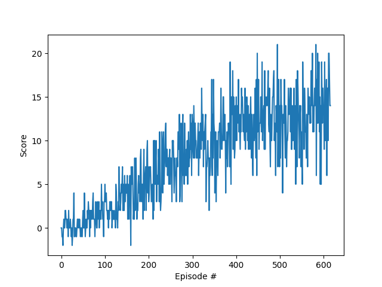

### Algorithm:
 The used algorithm is a variant of Q_learning. It uses fixed targets, which means that there are two neural networks for approximating the Q-values.
 The local network is used by the agent to compute the Q-values for acting. The target network computes Q-values for the next state that are used in the learning process.
 Just the local network is trained with the TD-error computed with the SARSAmax formula. The target network can be soft updated every time the local network is trained,
 which means that the weights of the target network are set to a convex combination of the weihts of both networks with parameter TAU. The other option is that the values
 from the local network are copied to the target network all UPDATE_TARGET_EVERY steps. This is called hard update. The parameter SOFT_UPDATE controls, which of the two variants is used.
  The algorithm uses an experience replay buffer, in which
 the experience from the environment is stored. One element of experience consists of a state, an action, the resulting next state, the resulting reward and whether or not it is a
 terminal state. Every time the local network is trained, it samples a minibatch from the replay buffer with equal probability and uses it for computing TD-errors for learning.
 The parameter DOUBLE_Q controls, whether Double Q learning is used or not. If Double Q learning is used, the target value is computed by first determining the best action with
 the local network and afterwards using the value from the target network for the next state and the previously computed action. This reduces the number of learning steps, but increases the running time due to
 additional evaluations. The parameter PRIORITIZED_EXP_REPLAY controls, whether prioritized experience replay is used or not. If it is true, we save a priority value for every
 element in the replay buffer. This is used as a weight in the sampling process. The priority used here is the absolute value of the TD-error. Because sampling with weights is very time consuming for large number of elements in the
 replay buffer, we used in this case the sum tree queue data structure, which consists of a queue that stores all nodes and a sum tree. The sum tree is used for sampling
 efficiently and the queue for understanding, which node to delete, when the buffersize is reached. The idea of using sum trees comes form the paper "PRIORITIZED EXPERIENCE REPLAY"
 by Schaul et al.. To neutralize a bias that is introduced by the weighted sampling the TD-errors are multiplied with an importance sampling weight before training the network.
 The parameter B controls how much of this weight is used and B is increased over time. For new experiences, the priority is set to the maximum priority that is observed so far.
 After an experience is used, the priority is updated to the absolute value of the TD-error.

### Structure
- file "Agents.py" contains the Agent class that defines an agent of the reinforcement problem and contains the following functions
    - "init" : initializing the agent
    - "step" : saving the data of the environment in the replay buffer and learn afterwards
    - "act" : returns the action for a given state following the epsilon-greedy policy
    - "learn" : updates the neural networks
    - "soft_update" : updates the target network with a soft update
    - "hard_update" : updates the target network by copying all values from the local network
    - "samples_to_environment_values" : extracts environment data from a set of samples of elements of the replay buffer
- file "Hyperparameter.py" contains the hyperparameter class. All hyperparameters and settings for the algorithm cab be set
here for global use 
- file "Main.py" is for starting the program
- file "Neural_networks.py" contains the QNetwork class that defines the deep neural networks that computes q values from states and contains the following functions:
    - "init" : initializing the network
    - "forward" : defines order of layers and activation functions
    - "evaluate" : outputs the action values for a given state
    - "save" : saves state_dict to file
- in the file "QLearning.py" the Q learning algorithm is implemented. It contains the following methods:
    - "profiling": outputs times for the most time consuming tasks
    - "dqn_gym": deep q learning algorithm for the gym environment
    - "dqn_unity": deep q learning algorithm for the unity environment
    - "start_agent_unity": starting the unity environment, creating an agent and start algorithm
    - "start_agent_gym": starting the gym environment, creating an agent and start algorithm
- file "Profile.py" contains the Profile class, in which different statistics are saved
- file "Replay_buffer.py" contains the class ReplayBuffer, in which memories about observed (state, action,next state, reward, done) quintuples are stored. It contains the following methods
    - "init": initializes a new Replay buffer
    - "add": add memory to replay buffer
    - "sample": samples a batch of experiences from the Replay buffer
    - "len": returns the length of the Replay buffer
- file "Sum_tree.py" contains the classes Sum_tree_queue, Sum_tree and Sum_tree_element that are used if the prioritized replay buffer is active
- file "Test.py" contains a test for the Sum_tree data structure

    
### Hyperparameters:
The following list shows the hyperparameters chosen for learning. For more details see file "Hyperparameter.py".
- LOAD = False            
- FILENAME_FOR_LOADING="Banana"  
- SAVE = True             
- FILENAME_FOR_SAVING="Banana"  
- PLOT = True           
- PLOTNAME = "BANANA_Scores.png" 
- WITH_PROFILING = False  
- ENV_TRAIN = True       
- VAL_ENV_SOLVED = 13.0   
- SOFT_UPDATE = True      
- DOUBLE_Q= True         
- PRIORITIZED_EXP_REPLAY= False          
- NR_EPISODES=2000
- MAX_NR_STEPS=1000
- EPS_START=1.00
- EPS_END=0.01
- EPS_DECAY=0.995
- B_START=0.4
- B_END=1.00
- B_INCREASE=1.005
- A=0.6                   
- BUFFER_SIZE = 10000    
- BATCH_SIZE = 64         
- GAMMA = 0.99            
- TAU = 0.001             
- LR = 0.0005             
- UPDATE_EVERY = 4        
- UPDATE_TARGET_EVERY = 20 
- hidden_layers=[64,64]

### Neural Network Architecture:
The neural networks used by the trained algorithm consist of an input layer with 37 neurons, two linear hidden layers with 64 neurons and an output layer with 4 neurons. Before the hidden layers and the output layer a relu activation function is used.

### Results:
The following figure displays the score of the agent during the learning process over 625 episodes, each consisting of at most 1000 steps. The average score per episode in the episodes 525-625 is 13.0 and therefore the environment is considered solved after 525 episodes. 

### Observations:
- Double Q Learning reduces the number of learning steps, but increases the running time
- ***my implementation of the algorithm with a prioritized replay buffer does not work well. 
 It is not able to solve the Bananas environment because it gets stuck at an average score of 9 to 10 and for LunarLander it even becomes worse during 
 the learning process. Please review the relevant passages (file "Agent.py" lines 96-117 and 151-152, file "Replay_buffer.py" lines 26-28 and 35-36, file "Sum_tree.py") and tell me my mistake. I am quite sure that the Sum_tree class is not the problem. I assume that the max_importance_sampling_weight
 inside the function "learn" in file "Agent.py" is not correct.***

### Future Improvements:
- include ideas from the paper "Dueling Network Architectures for Deep Reinforcement Learning" by Wang et al.
- include ideas from the paper "NOISY NETWORKS FOR EXPLORATION" by Fortunato et al.
- convolutional layers might the improve agent
    
    

